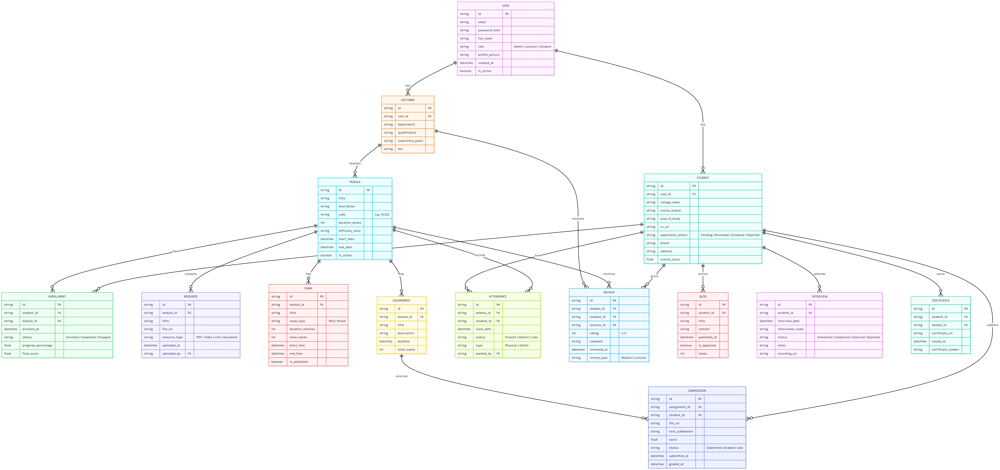

# DAAI Fellowship Platform - Project Details



---

# Project Overview

**DAAI Fellowship Platform** is a centralized Fellowship Management System designed to bridge the gap between academic learning and industry requirements.

The platform helps manage the complete fellowship lifecycle including:

- Student applications
- Skill development training
- Module/course management
- Assessments and assignments
- Attendance tracking
- Performance analytics
- Internship and job opportunities
- Certification and skill badges

The system supports multiple user roles and provides dashboards tailored to each role.

---

# Project Goal

The primary goal of the platform is to:

- Recruit talented students from colleges
- Deliver practical industry-oriented training
- Track student growth and performance
- Evaluate technical and soft skills
- Connect qualified fellows with employers

The platform aims to create a scalable ecosystem for fellowship management and career development.

---

# User Roles

## 1. Admin

The super user of the platform responsible for system-wide management.

### Responsibilities

- Manage students and lecturers
- Create and manage modules/courses
- Assign lecturers to modules
- Monitor attendance and performance
- Review fellowship applications and CVs
- Manage interview pipeline
- Publish announcements
- View analytics and reports

---

## 2. Lecturer / Instructor

Responsible for delivering learning content and evaluating fellows.

### Responsibilities

- Manage assigned modules
- Upload learning resources
- Create MCQ exams and assignments
- Track attendance
- Grade submissions
- Monitor student progress
- Receive feedback and ratings

---

## 3. Student / Fellow

Main learner within the fellowship program.

### Responsibilities

- Apply for fellowship programs
- Access learning materials
- Take exams and submit assignments
- Track progress and badges
- Write blogs/reflections
- Participate in discussions
- View internship/job opportunities
- Build personal portfolio

---

# Core Features

## Fellowship Application System

- Public application form
- CV upload support
- Application review pipeline
- Student shortlisting

---

## Course / Module Management

- Create structured learning modules
- Organize lessons and resources
- Lecturer assignment system

---

## Attendance System

Supports:

- Physical class attendance
- Online attendance tracking

---

## Assessment System

Includes:

- MCQ exams
- Auto-grading
- Assignment submissions
- Manual grading

---

## Discussion Forums

Module-wise discussions for collaborative learning.

---

## Certification System

Automatic certificate generation after successful module completion.

---

## Skill Badge System

Students earn badges based on:

- Performance
- Participation
- Milestones
- Attendance

---

## Analytics Dashboard

Visual analytics for:

- Student performance
- Completion rates
- Attendance
- Feedback trends

---

## Internship & Employer Portal

Employers can browse shortlisted fellows and internship-ready students.

---

# Technology Stack

## Backend

- FastAPI
- MongoDB
- Motor
- Beanie ODM
- JWT Authentication
- Redis
- Celery

---

## Frontend

- React (Vite)
- Zustand
- TanStack React Query
- Axios
- Tailwind CSS
- shadcn/ui

---

# Backend Architecture

```txt
Routes → Services → Repositories → Database
```

---

# Frontend Architecture

```txt
Pages → Hooks → Services → API → Backend
```

---

# Database Design

The ERD diagram above represents the planned database structure for:

- Users
- Courses
- Modules
- Assignments
- Exams
- Attendance
- Applications
- Certificates
- Blogs
- Discussions
- Skill Badges

---

# Intelligent Features

## Notification System

Supports:

- Email notifications
- In-app notifications
- Event reminders

---

## Analytics & Insights

Provides:

- Performance tracking
- Progress visualization
- Attendance monitoring
- Feedback analysis

---

## Employer Integration

Supports:

- Internship opportunities
- Job postings
- Employer access to shortlisted fellows

---

# Scalability Goals

The platform is designed to support:

- Multiple fellowship batches
- Thousands of students
- Multiple instructors
- Real-time interactions
- Employer integrations

---

# Development Principles

The system follows:

- Modular architecture
- Separation of concerns
- Scalable folder structures
- Async backend architecture
- Clean API design
- Reusable frontend components

---

# Repository Structure

```txt
DAAI-Fellowship-Platform/
├── daai-backend/
├── daai-webapp/
├── resources/
│   └── daai_erd.png
├── README.md
└── PROJECT_DETAILS.md
```

---
